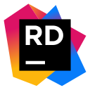

# 👋 Hi! Welcome to my GitHub profile, I'm Gabriel Zitelli

---
### 🎓 About me
- Software Engineer Student at the Faculty of Engineering of the University of Buenos Aires
- Looking to learn new skills to improve as a professional as much as possible

---
### 💻 Tools I've used or I'm using
Programming Languages:

	
	
	
	
	
	
	

Technologies and Frameworks:

	
	
	
	
 	
	

Operating Systems:

	
	
	

IDEs:

	
	
	
 	
	

Other:

	
	
	
	
	

---
### 📊 Stats of my profile

